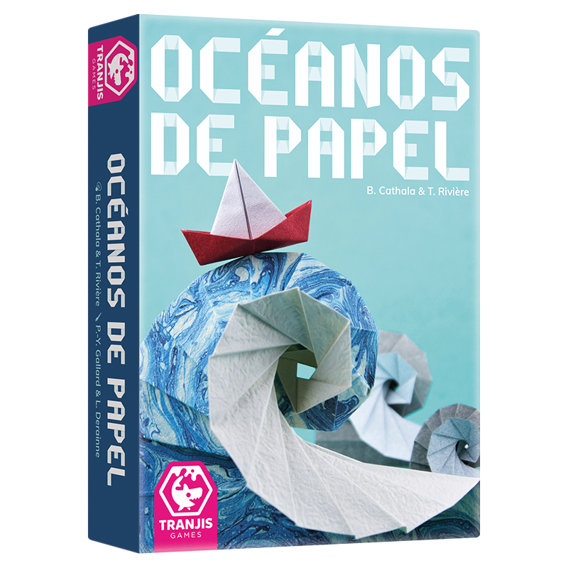
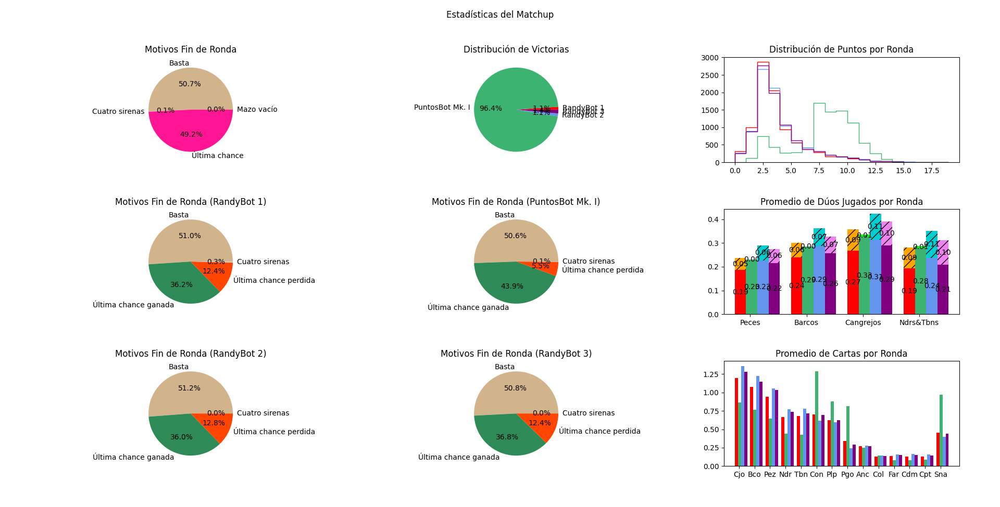

# oceanos-juego

¡Que las Cuatro Sirenas guíen tu camino!



## Dependencias

Para poder usar cualquiera de las cosas en este repositorio, bajar las dependencias ejecutando desde `src/` el comando `pip install -r requirements.txt`.

## Tutorial: ¿cómo hago mi bot?

1. Copiar la carpeta [`src/jugador/Ejemplo`](https://github.com/AugustoNicola/oceanos-juego/tree/main/src/jugador/Ejemplo) en el mismo directorio y cambiar el nombre del archivo, como `src/jugador/MiBot/bot_fachero.py`.
2. Modificar el nombre de la clase `EjemploDeBot` por otro, como `BotFachero`.
3. Escribir el nombre del bot justo arriba del nombre de la clase, en `@registrarComo("bot_fachero")`
4. En [`src/jugador/__init__.py`](https://github.com/AugustoNicola/oceanos-juego/blob/main/src/jugador/__init__.py), agregar al final una línea que importe tu nuevo archivo (como `import jugador.BotFachero.bot_fachero`). No hace falta terminar la línea en `.py`.
5. Implementar los [métodos de la interfaz](https://github.com/AugustoNicola/oceanos-juego/tree/main/src/jugador), según los comentarios

Para entender qué deberían hacer los métodos a implementar y cómo, revisar la documentación (archivos README.md en las subcarpetas de `src/`)

### Probar tu Bot

Podés probar tu Bot de las siguientes maneras:

* Podés hacerlo jugar muchas partidas contra otros Jugadores y ver estadísticas usando el [sistema de Matchups](https://github.com/AugustoNicola/oceanos-juego/blob/main/src/matchup/README.md).
* Podés ver cómo juega o jugarle vos mismo, a través usar la [interfaz web](https://github.com/AugustoNicola/oceanos-interfaz).
* También podés correr partidas manualmente con el [administrador de partidas](https://github.com/AugustoNicola/oceanos-juego/blob/main/src/administrador/README.md).

## Componentes

### Partida
La clase `PartidaDeOcéanos` modela el estado y acciones posibles a lo largo de una única partida del juego (con múltiples rondas) entre 2-4 jugadores. Tiene métodos para realizar las acciones correspondientes en cada momento, y expone las propiedades que el jugador actual debería concoer en una partida real.

```python
>>> from juego.partida import PartidaDeOcéanos
>>> partida = PartidaDeOcéanos(cantidadDeJugadores=2)
>>> partida.iniciarRonda()
>>> partida.deQuiénEsTurno
0
>>> partida.topeDelDescarte[0]
Carta de Cangrejo negro
>>> partida.robarDelDescarte(0)
Carta de Cangrejo negro
>>> partida.topeDelDescarte[0]
None
>>> partida.mano.total()
1
```

Para más información sobre los métodos y atributos disponibles para usar en los Jugadores, ver [el README de juego/](src\juego\README.md).

### Administrador de Juego

La clase `AdministradorDeJuego` actúa como puente entre instancias de `PartidaDeOcéanos` y los Jugadores. Su tarea es invocar los métodos correspondientes que los Jugadores implementan y usar sus respuestas para resolver las diferentes fases del juego con llamadas a métodos de `PartidaDeOcéanos`.

Para más información sobre cómo el administrador traduce entre `PartidaDeOcéanos` y Jugadores, ver [el README de administrador/](src\administrador\README.md).

```python
>>> administrador = AdministradorDeJuego(['randybot', 'sirena_hater'])
>>> ganador = administrador.jugarPartida()
0 # ganó randybot
>>> ganador = administrador.jugarPartida()
1 # ganó sirena_hater
```

### Jugadores

Para que un jugador pueda entenderse con el `AdministradorDeJuego`, se necesita que [subclasifique](https://www.w3schools.com/python/python_inheritance.asp) la clase `JugadorBase`. Esta clase define los cinco métodos que `AdministradorDeJuego` invoca sobre cada jugador para resolver las acciones de juego (cómo se quiere robar, si se quieren jugar dúos, cómo se pasa de ronda, etc.). Por supuesto, además de implementar estos métodos necesarios, un jugador puede definir tantas variables internas y métodos auxiliares como sean necesarios.

Para más información sobre cómo implementar un Bot y ejemplos, ver [el README de jugador/](src\jugador\README.md).

```python
>>> juego = PartidaDeOcéanos(cantidadDeJugaodres=2) # creamos una partida
>>> miBot = RandyBot()
>>> otroBot = SirenaEnjoyer()
>>> miBot.configurarParaJuego(juego, númeroDeJugador=0, listaDeEventos=None)
>>> otroBot.configurarParaJuego(juego, númeroDeJugador=1, listaDeEventos=None)
>>> juego.iniciarRonda()
>>> miBot.decidirAcciónDeRobo() # con esto vemos qué quiere hacer el bot
Acción.Robo.DEL_MAZO
>>> cartas = juego.robarDelMazo() # y con esto ejecutamos la acción
[Carta de Pulpo verde, Carta de Pez negro]
>>> miBot.decidirCómoRobarDelMazo(cartas)
(0, 1)
```

### Matchups

`src/matchup/matchup.py` utiliza los parámetros definidos al principio del archivo para disputar una serie de partidas entre Jugadores. Para ello, utiliza el `AdministradorDeJuego` y las métricas que éste recolecta para generar estadísticas del duelo. Para usarlo, simplemente modificar los parámetros `jugadoresDelMatchup`, `nombres` y `cantidadDePartidasAJugar`, y luego iniciar el duelo con `cd src/ && python -m matchup.matchup`.



Para más información sobre cómo hacer un matchup entre Jugadores y ejemplos, ver [el README de matchup/](src\matchup\README.md).


### Backend

Este módulo se encarga de responder a las peticiones de la [interfaz web](https://github.com/AugustoNicola/oceanos-interfaz) para poder jugar una partida desde el navegador.

Para más información sobre cómo preparar el backend para jugar por la interfaz, ver [el README de backend/](src\backend\README.md).

